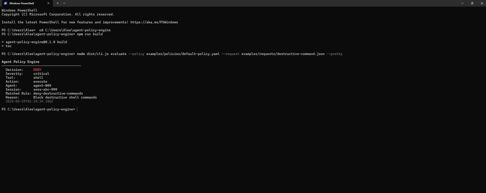
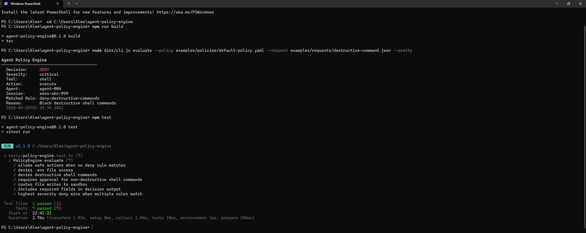

# Agent Policy Engine


**Policy-based control layer for AI agent tool use.**

A lightweight policy engine for AI agent tool-use governance. Evaluates proposed tool calls from AI agents against declarative YAML/JSON policy rules and returns structured decisions: `allow`, `deny`, `sandbox`, or `approval_required`.

Built for the [Aegis Platform](https://github.com/VisualOps-AI/aegis-platform) ecosystem. Designed to sit between an AI agent's intent and its execution layer, enforcing security boundaries before actions reach production systems.

This project demonstrates a practical control layer for AI agents that need access to filesystems, shells, APIs, databases, or internal business tools.

## Current Status

Agent Policy Engine is an MVP portfolio project with working CLI evaluation, YAML/JSON policy loading, schema validation, deterministic rule matching, decision priority, and test coverage.

Current focus: keeping the engine small, predictable, and easy to integrate into agent execution layers.

## Problem

AI agents are increasingly being given access to filesystems, shells, APIs, browsers, databases, and internal tools.

Without a policy layer, every tool call is implicitly trusted.

That creates risk when an agent attempts to read secrets, execute destructive commands, write to sensitive paths, exfiltrate data, or perform actions that should require human approval.

## How It Works

| Request | Policy Match | Decision |
|---|---|---|
| Read `README.md` | No risky rule | `allow` |
| Read `.env` | `deny-env-access` | `deny` |
| Write to `src/` | `sandbox-file-write` | `sandbox` |
| Run shell command | `approve-shell-commands` | `approval_required` |
| Run `rm -rf` | `deny-destructive-commands` | `deny` |

## Solution

Declarative policy files define what agents can and cannot do. The engine matches incoming tool-call requests against rules and returns a structured decision with severity, reasoning, and audit metadata. No agent modification required -- this sits in the execution path as a gate.

## Quick Start

```bash
# Install
npm install
npm run build

# Evaluate a request against a policy
node dist/cli.js evaluate \
  --policy examples/policies/default-policy.yaml \
  --request examples/requests/destructive-command.json

# Pretty output
node dist/cli.js evaluate \
  --policy examples/policies/default-policy.yaml \
  --request examples/requests/safe-read.json \
  --pretty

# Run tests
npm test
```

## Example Policy

```yaml
name: default-agent-policy
version: "1.0"
defaultDecision: allow
defaultSeverity: low

rules:
  - id: deny-env-access
    description: Block access to .env and secret files
    decision: deny
    severity: critical
    match:
      tool: file_*
      pathPatterns:
        - "*.env"
        - "*credentials*"

  - id: sandbox-file-write
    description: Route file write operations to sandbox
    decision: sandbox
    severity: medium
    match:
      tool: file_write
      action: write
```

## Example Request

```json
{
  "agentId": "agent-004",
  "sessionId": "sess-abc-999",
  "tool": "shell",
  "action": "execute",
  "parameters": { "command": "rm -rf /var/data" },
  "metadata": {
    "command": "rm -rf /var/data",
    "tags": ["cleanup"]
  }
}
```

## Example Output

```json
{
  "decision": "deny",
  "severity": "critical",
  "matchedRule": "deny-destructive-commands",
  "reason": "Block destructive shell commands",
  "timestamp": "2026-05-28T12:00:00.000Z",
  "agentId": "agent-004",
  "sessionId": "sess-abc-999",
  "tool": "shell",
  "action": "execute"
}
```

## Proof Assets

Evidence the MVP works end to end: live policy decisions from the CLI and a passing test suite.



*The CLI evaluating an `rm -rf` request against the default policy — matches `deny-destructive-commands`, returns `DENY` (critical), and exits non-zero so the calling layer can block.*



*Full test suite passing — 7/7 covering the allow, deny, sandbox, and approval_required decision paths.*

## Architecture

```
Agent Request (JSON)
        |
        v
  ┌─────────────┐
  │ Schema       │  Zod validates request + policy structure
  │ Validation   │
  └──────┬───────┘
         v
  ┌─────────────┐
  │ Rule         │  Matches tool, action, path, command, tags
  │ Matcher      │
  └──────┬───────┘
         v
  ┌─────────────┐
  │ Risk         │  Sorts by decision priority + severity weight
  │ Scoring      │
  └──────┬───────┘
         v
  ┌─────────────┐
  │ Decision     │  Structured output with audit metadata
  │ Output       │
  └─────────────┘
```

**Decision priority**: deny > sandbox > approval_required > allow

When multiple rules match, the highest-priority decision with the highest severity wins. Deterministic, no ambiguity.

See [docs/architecture.md](docs/architecture.md) for full details.

## Match Criteria

| Criteria | Description | Example |
|----------|-------------|---------|
| `tool` | Glob match on tool name | `file_*`, `shell` |
| `action` | Glob match on action name | `write`, `execute` |
| `pathPatterns` | Glob match on file path | `*.env`, `*credentials*` |
| `commandPatterns` | Substring match on command | `rm -rf`, `drop table` |
| `tags` | Any-of match on metadata tags | `secret-access` |

All criteria in a rule must match (AND logic). If a criterion is omitted, it matches everything.

## Roadmap

- **v0.2**: Webhook integration for approval_required decisions
- **v0.3**: Agent identity verification and session-scoped policies
- **v0.4**: Real-time policy hot-reload without restart
- **v1.0**: Integration with Aegis Platform as the policy evaluation layer

See [docs/roadmap.md](docs/roadmap.md) for the full plan.

## Non-Goals

Agent Policy Engine does not execute tool calls directly.

It does not replace identity management, sandboxing, network security, or human review.

Its role is to evaluate proposed actions and return structured decisions that another system can enforce.

## Relationship to Aegis / Witness

Agent Policy Engine is designed as a standalone control layer that can plug into the broader Aegis ecosystem.

- **Aegis / Phantom** identifies dangerous permissions, weak auth boundaries, and risky tool-chain paths.
- **Agent Policy Engine** evaluates proposed tool calls against declarative policies.
- **Witness** will enforce, sandbox, approve, and audit tool calls using policy decisions.

The engine can run independently as a CLI/library or become the policy evaluation layer inside Aegis middleware.

## License

MIT
